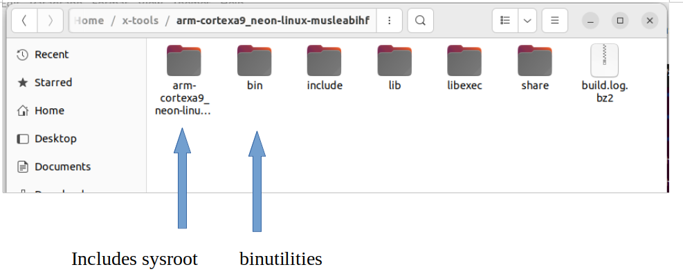

# Task3:

## Sysroot:

- The sysroot is a directory that contains the essential system files  and libraries needed for cross-compiling applications. It serves as a  simulated root file system for the target architecture (arm a9). The sysroot is  used during the cross-compilation process to locate headers, libraries,  and other dependencies specific to the target environment. It ensures  that the compiled application is compatible with the target system by  providing the necessary files and resources.

  the following image shows the file system of the /sysroot / usr , it contains as shown all the header, object , shared and static libraries files that the user will need at compilation processes

  

   the following image shows the file system of the /sysroot / lib, it contains the shared and static libraries that the target system needs , such as musl, atomic, gcc, and c++ ......etc

## Binutils:

- Binutils is a collection of binary utilities that are used for  manipulating object files, executables, and libraries. It includes tools such as the linker (ld), assembler (as), and object file utilities  (objdump, objcopy, etc.). Binutils plays a vital role in the compilation and linking process, transforming the compiled code into executable  files, resolving symbols, and managing the various sections of the  binary. It is an essential component of the toolchain and ensures the  proper functioning of cross-compiled applications on the target  architecture.

  

as shown in the above image the arm cortexa9 contains the following binutilities (ls , ldd, objdump, strip, strings, nm, size, gcc, ar, as, gdp , and others ).